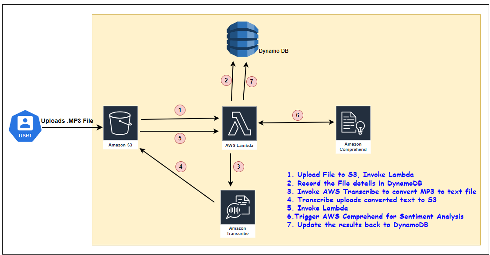
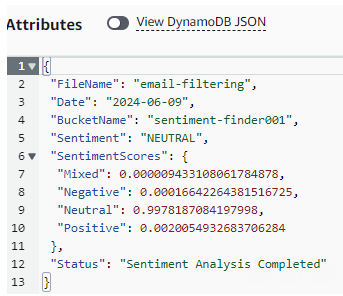

# Audio Sentiment Analysis CloudFormation Template

This CloudFormation template sets up an S3 bucket, a Lambda function, and a DynamoDB table for an audio sentiment analysis project. The S3 bucket triggers the Lambda function when new audio files are uploaded, which transcribes the audio and performs sentiment analysis, storing the results in DynamoDB.

## Architecture

## Resources Created

- **S3 Bucket**: Stores audio files and transcribed text files.
- **Lambda Function**: Processes the audio files by transcribing them and analyzing sentiment.
- **DynamoDB Table**: Tracks file processing status and stores sentiment analysis results.

## Parameters

- `ProjectName`: The name of the project (default: `Audio-Sentiment-Analysis`).
- `S3BucketName`: The name of the S3 bucket to be created.

## Setup Instructions

1. **Create the CloudFormation Stack**: Use this template to create a CloudFormation stack in your AWS account. Provide the `ProjectName` and `S3BucketName` parameters.

2. **Upload Audio Files**: Upload audio files to the `sourcefiles/` folder in the S3 bucket to trigger the Lambda function.

3. **Monitor Processing**: Check the DynamoDB table to monitor the progress and results of the sentiment analysis.

## Sample DynamoDB Output

## Detailed Resource Information

### S3 Bucket

The S3 bucket is configured to notify the Lambda function upon the creation of objects in the `sourcefiles/` and `transcribedfiles/` folders.

### Lambda Function

The Lambda function handles two main tasks:
- **Transcription**: Starts a transcription job for audio files placed in the `sourcefiles/` folder.
- **Sentiment Analysis**: Analyzes the sentiment of transcribed text files in the `transcribedfiles/` folder.

The function uses the following environment variables:
- `DynamoTableName`: Name of the DynamoDB table.
- `TranscribeRoleARN`: ARN of the IAM role for Amazon Transcribe.

### DynamoDB Table

The DynamoDB table named `<ProjectName>-FileTracker` stores the status of each file processed, along with the results of the sentiment analysis.

### IAM Roles

Two IAM roles are created:
- `LambdaExecutionRole`: Grants permissions to the Lambda function for accessing S3, Transcribe, Comprehend, and DynamoDB.
- `TranscriberExecutionRole`: Grants permissions for Amazon Transcribe to access S3.

### Custom Resources

Custom Lambda functions manage the creation and deletion of folders within the S3 bucket.

## Developer

Janarthanan Kugathasan

